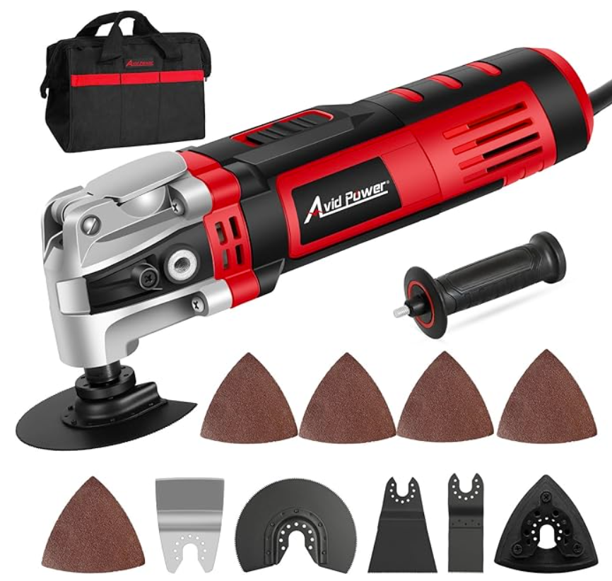
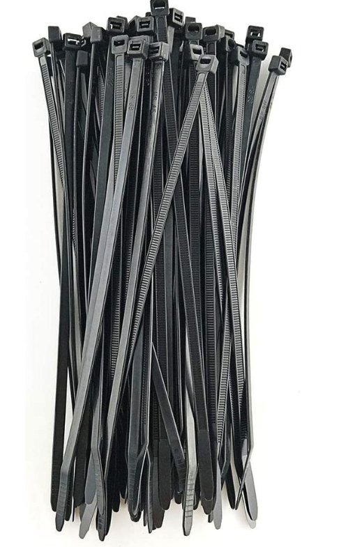

# Recommended Electrical and Plumbing Components

This comprehensive guide includes all the electrical and plumbing components recommended for your Vantopia van conversion. We don't include these systems in our kits, but we provide this detailed guide to help you source everything you need for a complete DIY installation.

**📞 Questions?** Contact our support team: **949 755 0337** | **support@vantopiavans.com**

---

## 📑 Table of Contents

**I. [Tools](#i-tools)**  
**II. [Insulation](#ii-insulation)**  
**III. [Vent Installation](#iii-vent-installation)**  
**IV. [Solar](#iv-solar-system)**  
**V. [Electrical](#v-electrical-system)**  
**VI. [Plumbing](#vi-plumbing-system)**  
**VII. [Bamboo Finish](#vii-bamboo-finish)**

---

## I. Tools

*If you have a comparable tool, no need to buy another. Feel free to ask our support team if you have any questions.*

### 1. Crimping Tool & Connectors

**Amazon Link**: [View Product](https://a.co/d/example)  
**Application**: Used to connect wires together and to add spade or ring connections.  
**Quantity**: 1 set

---

### 2. Cordless Drill/Driver

**Amazon Link**: [View Product](https://a.co/d/example)  
**Application**: Used to assemble kit components as well as various other installation jobs.  
**Quantity**: 1

---

### 3. PEX Crimp Clamp Cinch Tool

**Amazon Link**: [View Product](https://a.co/d/example)  
**Application**: Used to cut PEX tubing to length and crimp connections for hot and cold plumbing.  
**Quantity**: 1

---

### 4. 2" Hole Saw

**Amazon Link**: [https://a.co/d/0iiAl9K](https://a.co/d/0iiAl9K)  
**Application**: Used to cut holes for solar port and shore power port.  
**Quantity**: 1

---

### 5. Jig Saw

**Amazon Link**: [View Product](https://a.co/d/example)  
**Application**: Used to cut vent holes in the roof. Not needed for the rest of the kit.  
**Quantity**: 1

---

### 6. Metal T-Shank Jig Saw Blades

**Amazon Link**: [View Product](https://a.co/d/example)  
**Application**: Used with jigsaw to cut vent holes in roof.  
**Quantity**: 1 pack

---

### 7. Random Orbit Sander

**Amazon Link**: [View Product](https://a.co/d/example)  
**Application**: Used to sand edges of kit parts.  
**Quantity**: 1

---

### 8. 220 Grit Sand Paper

**Amazon Link**: [View Product](https://a.co/d/example)  
**Application**: Used with palm sander to help sand edges of kit parts.  
**Quantity**: 1 pack

---

### 9. Caulking Gun

**Amazon Link**: [View Product](https://a.co/d/example)  
**Application**: Used in applying Sikaflex to vent installation. May also be used during solar installation.  
**Quantity**: 1

---

### 10. Oscillating Multi Tool

**Amazon Link**: [View Product](https://a.co/d/example)  
**Application**: Used to cut off tabs from kit sheets to prepare for sanding. Also used to cut panel connector strips to length.  
**Quantity**: 1

---

### 11. (OPTIONAL) Oscillating Spindle Sander

**Amazon Link**: [View Product](https://a.co/d/example)  
**Application**: Used to sand inner corners where the palm sander can't reach. Optional but recommended.  
**Quantity**: 1

---

## II. Insulation

### 1. Thinsulate

**Swivel Shop**: [https://swivelshop.com](https://swivelshop.com)  
💰 **Use "Vantopia" code for 5% off order**

**Application**: Used in the insulation of the van.  
**Quantity**: 
- Short vans (136-144): Approximately **50 feet**
- Long vans (159-170): Approximately **70 feet**
- **Alternative**: Havelock Wool can be used instead

---

### 2. Spray Adhesive

**Swivel Shop**: [https://swivelshop.com](https://swivelshop.com)  
💰 **Use "Vantopia" code for 5% discount**

**Application**: Used to bond Thinsulate to the walls of the van.  
**Quantity**: Recommended **two cans**

---

## III. Vent Installation

### 1a. Vent Fan

**Amazon Link**: [View Product](https://a.co/d/example)  
**Application**: Used to help with ventilation in the van.  
**Quantity**: **One or two** are recommended depending on van size and personal preference. Two vents add more airflow but limit the amount of solar allowed on the roof.

---

### 1b. Maxxfan Deluxe Vent, Fan and Vent Cover All in One

**Amazon Link**: [View Product](https://a.co/d/example)  
**Application**: Rain proof vent option. Used to help with ventilation in the van.  
**Quantity**: **One or two** are recommended depending on van size and personal preference. Two vents add more airflow but limit the amount of solar allowed on the roof.

---

### 2. Butyl Seal Tape

**Amazon Link**: [View Product](https://a.co/d/example)  
**Application**: Used to create an even-level plane for the vent to mount to.  
**Quantity**: Approximately **1 per vent**

---

### 3. Polyurethane Sealant (Sikaflex)

**Amazon Link**: [View Product](https://a.co/d/example)  
**Application**: Used to seal vent and prevent water from entering the van. Also used if roof mounted solar brackets are used.  
**Quantity**: **One per vent** (up to 1.5 tubes per vent is acceptable)

---

## IV. Solar System

**⚠️ Note**: Solar has many potential configurations depending on how much power is needed, vent placement, mounting system, and van model. If you have any questions feel free to reach out to our support team: **949 755 0337**

### 1. Solar Panels

**Amazon Link**: [https://a.co/d/atRjsVA](https://a.co/d/atRjsVA)  
**Application**: Mounted to the roof of the van to provide power to the power station. Some power stations such as Goal Zero have a max of 50V input and cannot have more than two panels in a series configuration. If you have any questions about solar wiring or what panels would be best for you please contact Vantopia or your power station manufacturer.  
**Quantity**: Varies depending on how much roof space is available after vent installations. We'd recommend at least **200 Watts** of rated power.

---

### 2. Solar Panel Extension Cable

**Amazon Link**: [https://a.co/d/2SNSBs3](https://a.co/d/2SNSBs3)  
**Application**: Used to extend the solar wires from the roof through the pass-through gland and into the van to connect to the power station. Cables will have to be cut in order to pass through entry gland.  
**Quantity**: Recommend either the **15 foot** or **20 foot** lengths. One pair should be sufficient.

---

### 3. 2" Rubber Grommets

**Amazon Link**: [https://a.co/d/2GhMyib](https://a.co/d/2GhMyib)  
**Application**: Used to cover the hole cut in the roof by the 2" hole saw. Protects the solar wire from the sharp metal edge.  
**Quantity**: Only **one** used on the roof but another will be used on the optional shore power plug.

---

### 4. Solar Mounting Bracket

**Amazon Link**: [https://a.co/d/3OfwELD](https://a.co/d/3OfwELD)  
**Application**: Used to mount solar panels directly to the roof of the van. Strongly recommended to use sealant on top of bolt holes to prevent leaks. Alternatively panels may be mounted to the van manufacturer's factory mounting rail. Contact Vantopia Vans to find out which option may be best for you.  
**Quantity**: **4 brackets per panel**

---

### 5. Solar Double Cable Entry Gland Box

**Amazon Link**: [https://a.co/d/7yE7xUV](https://a.co/d/7yE7xUV)  
**Application**: Used to pass solar cables through the roof of the van into the interior to connect to the power station. Solar cables will have to be cut in order to fit through the gland ports. Sikaflex must be used when mounting to prevent leaks. Gland ports are tightened to fit properly around each cable.  
**Quantity**: Only **one** needed

---

### 6. Y-Branch Cable, Solar Cable Parallel Adaptor

**Amazon Link**: [https://a.co/d/h54K1Nx](https://a.co/d/h54K1Nx)  
**Application**: Used to connect panels in parallel instead of series.  
**Quantity**: **One or two** needed depending on configuration. Only needed if panels in parallel.

---

### 7. Tower Brackets Compatible with Sprinter (Alternative Brackets)

**Amazon Link**: [https://a.co/d/24bUE8B](https://a.co/d/24bUE8B)  
**Application**: Only use as an alternative bracket for **Sprinters with factory rail mount system**.  
**Quantity**: **Two pairs** are needed per panel.

---

### 8. Solar Panel 175 Watt 12 Volt (Sprinter Alternative)

**Amazon Link**: [https://a.co/d/iNk5jZP](https://a.co/d/iNk5jZP)  
**Application**: Only use as an alternative to other solar panels on **Sprinters with rail mounted brackets**.  
**Quantity**: **One or two panels** recommended. May be influenced by number and placement of roof vents.

---

## V. Electrical System

**⚠️ Note**: Additional connectors may be needed to connect the solar input and DC output to your power station. Check with your power station to find the appropriate connectors.

### 1. 14 AWG Sheathed Double Conductor Marine Wire

**Amazon Link**: [https://a.co/d/bilnHcd](https://a.co/d/bilnHcd)  
**Application**: Used to connect DC appliances to the fuse and switch panel. Will connect appliances such as LED lights, vent fans, fridge, and water pump.  
**Quantity**: **50 feet** may be sufficient but **100 feet** would be recommended.

---

### 2. 12 Volt LED Lights

**Amazon Link**: [https://a.co/d/eb4gHfL](https://a.co/d/eb4gHfL)  
**Application**: Used to light the main cabin of the van.  
**Quantity**: One **8 pack**

---

### 3. 12 Circuit Fuse Block W/Negative Bus

**Amazon Link**: [https://a.co/d/gaUPqN7](https://a.co/d/gaUPqN7)  
**Application**: Used to provide an additional layer of safety and distribute power from the power station to the various appliances.  
**Quantity**: **1**

---

### 4. 8 Gang Rocker Switch Panel

**Amazon Link**: [https://a.co/d/dmOWCQO](https://a.co/d/dmOWCQO)  
**Application**: Used to switch on and off individual appliances such as lights, vents, and fridge.  
**Quantity**: **1**

---

### 5. 3-inch Desk Power Grommet

**Amazon Link**: [https://a.co/d/97mexpC](https://a.co/d/97mexpC)  
**Application**: Used to provide AC power to appliances in the bed and kitchen area.  
**Quantity**: 
- **2** with a basic kit or bathroom module
- **3** with combo module

---

### 6. UV Protected Zip Ties

**Amazon Link**: [https://a.co/d/eq7fRmW](https://a.co/d/eq7fRmW)  
**Application**: Used to organize wires internally and secure solar wires on the roof.  
**Quantity**: One pack of **100**

---

### 7. Split Wire Loom Tubing

**Amazon Link**: [https://a.co/d/gmoIJhM](https://a.co/d/gmoIJhM)  
**Application**: Used to organize wires inside the van. Optional but recommended.  
**Quantity**: One **25 foot 1.5" section**

---

### 8. Major Appliance Extension Cord UL Listed 14 Gauge

**Amazon Link**: [https://a.co/d/3T73tSW](https://a.co/d/3T73tSW)  
**Application**: Extends 120V plugs from plug clusters to the power station.  
**Quantity**: **Three to four** - One per plug cluster plus one for hot water heater.

---

### 9. Shore Power Plug

**Amazon Link**: [https://a.co/d/dYXLFBy](https://a.co/d/dYXLFBy)  
**Application**: Used to add shore power to the exterior of the van. Sikaflex should be used to prevent leaks.  
**Quantity**: Not required but **one** is recommended.

---

### 10. Cable Tie Mounts With Screws

**Amazon Link**: [https://a.co/d/gBAMHkw](https://a.co/d/gBAMHkw)  
**Application**: Used to help organize and secure wires.  
**Quantity**: Not required but recommended

---

### 11. 3-Outlet Lighted Black Extension Cord

**Application**: Used to combine extension cords if limited by power station plugs.  
**Quantity**: Only needed if not enough plugs are available on the power station

---

### 12. 12 Gauge Silicone Wire (10 ft Red and 10 ft Black Flexible)

**Amazon Link**: [https://a.co/d/ensx4AW](https://a.co/d/ensx4AW)  
**Application**: Used to connect power station to the fuse panel.  
**Quantity**: One order of **12 AWG 10 foot wire red/black**

---

## VI. Plumbing System

**⚠️ Note**: Plumbing configurations may vary depending on kit selection and layout. If you have any questions please contact the Vantopia Vans support team at **949 755 0337** | **support@vantopiavans.com**

### 1. PEX Pipe 1/2 Inch, Blue

**Amazon Link**: [View Product](https://a.co/d/example)  
**Application**: Runs cold water from tank to pump, hot water heater, and sink.  
**Quantity**: **25 ft** typically sufficient

---

### 2. PEX Pipe 1/2 Inch, Red

**Amazon Link**: [View Product](https://a.co/d/example)  
**Application**: Runs hot water from water heater to sink and optional showers.  
**Quantity**: **25 ft** typically sufficient

---

### 3. (30 pieces) 1/2" Brass PEX Fittings

**Amazon Link**: [https://a.co/d/2uRzqRI](https://a.co/d/2uRzqRI)  
**Application**: Connects PEX tubing together in joints and T-joints.  
**Quantity**: One **30 pack** of variety parts

---

### 4. 1/2 Inch Clamp Ring

**Amazon Link**: [https://a.co/d/2VwSti0](https://a.co/d/2VwSti0)  
**Application**: Securely attaches PEX connectors to PEX tubing.  
**Quantity**: One **100 pack** (not all are used)

---

### 5. Black Single Bowl Dual Mount Bar Sink

**Amazon Link**: [https://a.co/d/9g6hnRi](https://a.co/d/9g6hnRi)  
**Application**: Sink that is mounted into the kitchen island. If you'd prefer a different sink please contact us before your order to confirm fitment.  
**Quantity**: **One** - Select the option without drain and grill.

---

### 6. 3-1/2 Inch Kitchen Sink Stainless Steel Basket Strainer

**Amazon Link**: [https://a.co/d/1Bvah2O](https://a.co/d/1Bvah2O)  
**Application**: Mounts to drain of the sink. Plumber's putty must be added around the seal to prevent leaks.  
**Quantity**: **One**

---

### 7. Professional Grade Plumber's Putty

**Amazon Link**: [https://a.co/d/5QwVGfL](https://a.co/d/5QwVGfL)  
**Application**: Helps seal sink drain. Create a ring around the drain and test for leaks.  
**Quantity**: **One** - Hardly any is needed so if you already have some no need to buy another.

---

### 8. Flexible Camper Drain Tap

**Amazon Link**: [https://a.co/d/6qxdvyh](https://a.co/d/6qxdvyh)  
**Application**: Connects to sink to drain grey water to grey water tank.  
**Quantity**: **One**

---

### 9. Kitchen Faucet

**Amazon Link**: [https://a.co/d/6J1dUDv](https://a.co/d/6J1dUDv)  
**Application**: Sink faucet.  
**Quantity**: **One** - Alternative faucets may be used but must fit a 1.5" hole.

---

### 10. 2.5-gallon/10-liter Water Container

**Amazon Link**: [https://a.co/d/eLwjupf](https://a.co/d/eLwjupf)  
**Application**: Grey water holding tank.  
**Quantity**: **One or two** depending on desired grey water capacity. Alternative tanks may work as well.

---

### 11. PEX 1/2 Inch x 1/2 Inch Female NPT Drop-ear Elbow

**Amazon Link**: [https://a.co/d/dHidnG8](https://a.co/d/dHidnG8)  
**Application**: Connects to hot water heater for cold water in and hot water out.  
**Quantity**: One pack of **two**

---

### 12. PEX 1/2 Inch x 1/2 Inch Female NPT Drop-ear Elbow

**Amazon Link**: [https://a.co/d/6e8MJNH](https://a.co/d/6e8MJNH)  
**Application**: Connects PEX tubing to sink faucet.  
**Quantity**: One pack of **two**

---

### 13. Flojet 03526-144A Triplex Diaphragm Automatic Water System Pump

**2.9 GPM, 50 PSI, 12 volt DC**

**Amazon Link**: [https://a.co/d/2oM78hv](https://a.co/d/2oM78hv)  
**Application**: Provides water pressure for entire plumbing system. Auto-priming.  
**Quantity**: **One**

---

### 14. Flojet 01740300A Pump Mini-Strainer

**Amazon Link**: [https://a.co/d/ikSOjA4](https://a.co/d/ikSOjA4)  
**Application**: Strains incoming water to prevent larger contaminants from entering the pump.  
**Quantity**: **One**

---

### 15. 1/2 Inch PEX Clips

**Amazon Link**: [https://a.co/d/fHY6mMB](https://a.co/d/fHY6mMB)  
**Application**: Clips to PEX tubing to help organize and mount.  
**Quantity**: One pack of **50** - Only about 12 needed. Not required but recommended.

---

### 16a. 42 Gallon RV Concession Fresh and Gray Water Holding Tank

**Amazon Link**: [https://a.co/d/fW7fMFV](https://a.co/d/fW7fMFV)  
**Application**: Fresh water holding tank.  
**Quantity**: **One** - Only fits raised bed kits. Other tank options acceptable. Other tanks may require other fittings.

---

### 16b. Universal 20-Gallon Camper Van Wheel Well Water Tank

**Nomadic Supply**: [View Product](https://nomadicsupply.com/northwest-conversions-20-gallon-camper-van-wheel-well-water-tank-sp-c-20/)  
**Application**: Fresh water holding tank.  
**Quantity**: **One** - Fits dinette bed configurations.  
**⚠️ Warning**: This tank does not fit all dinette models. Confirm the fitment with the provided render.

---

### 16c. One Sided Wheel Well Water Tank

**Campervan HQ**: [View Product](https://www.campervan-hq.com/collections/wheel-well-water-tanks/products/northwest-conversions20-gallon-water-tank-sp-l-20)  
**Application**: Fits dinette bed configurations. Best for Transit vans.  
**⚠️ Warning**: This tank does not fit all dinette models. Confirm the fitment with the provided render.

---

### 17. Fresh Water Fill Hatch Inlet

**Amazon Link**: [https://a.co/d/hd9M7M8](https://a.co/d/hd9M7M8)  
**Application**: Fills fresh water tank.  
**Quantity**: **One**

---

### 18. Electric Mini-Tank Water Heater

**Amazon Link**: [https://a.co/d/6lhyFXO](https://a.co/d/6lhyFXO)  
**Application**: Hot water heater.  
**Quantity**: **One**

---

### 19. PEX 1/2"x 1/2" Male Threaded NPT

**Amazon Link**: [https://a.co/d/dJI6ybE](https://a.co/d/dJI6ybE)  
**Application**: Connects water tank to PEX.  
**Quantity**: One pack of **5** - Typically only one used.

---

### 20. PEX 1/2" x 1/2" NPT Female Threaded Adapter

**Amazon Link**: [https://a.co/d/f8BfFfg](https://a.co/d/f8BfFfg)  
**Application**: Connects water pump to PEX.  
**Quantity**: One pack of **6** - Typically only two used.

---

### 21. Quick Connect Detachable Spray Faucet (Optional Outdoor Shower)

**Amazon Link**: [https://a.co/d/guXUvU6](https://a.co/d/guXUvU6)  
**Application**: Optional outdoor shower. Uses two ½ NPT to PEX connectors. Requires teflon tape.  
**Quantity**: **One** - Optional.

---

### 22. PTFE Industrial Sealant Tape (Teflon Tape)

**Application**: Used to seal threaded plumbing fittings. Make sure to apply the tape in the same direction as the thread.  
**Quantity**: **One** - Common household item you may already have.

---

### 23. 1.5" Worm Gear Hose Clamp

**Amazon Link**: [https://a.co/d/hcp2LI0](https://a.co/d/hcp2LI0)  
**Application**: Secures braided fill hose to the fill port and tank port.  
**Quantity**: Only **two** are needed. Linked to pack of 10.

---

### 24. Plastic Barbed Hose Fitting

**McMaster-Carr**: [https://www.mcmaster.com/5218K721/](https://www.mcmaster.com/5218K721/)  
**Application**: Connects braided EVA tube to the water tank. It may vary depending on the water tank selected. PTFE tape is recommended.  
**Quantity**: **One**

---

### 25. High-Pressure Firm EVA Plastic Tubing

**McMaster-Carr**: [https://www.mcmaster.com/5632K41/](https://www.mcmaster.com/5632K41/)  
**Application**: Connects the water fill port to the water tank.  
**Quantity**: **One**

---

## VII. Bamboo Finish

### 1. Rubio Monocoat Oil

**Amazon Link**: [https://a.co/d/bQFNdSa](https://a.co/d/bQFNdSa)  
**Application**: Finish for bamboo surfaces. Protects and enhances natural wood beauty.  
**Quantity**: **350 mL**

**Application Tips:**
- Apply with microfiber cloth
- One coat is usually sufficient
- Buff after 15-20 minutes
- Reapply every 3-6 months for best results

---

## 📋 Installation Tips & Best Practices

### Electrical Installation
1. **Plan your layout** before starting - sketch out where everything will go
2. **Label all wires** - Use label maker or masking tape
3. **Test all circuits** before final assembly
4. **Use appropriate wire gauges** for amperage
5. **Install fuses** at appropriate ratings
6. **Keep DC and AC systems** separate
7. **Use strain relief** on all connections
8. **Check polarity** on all DC connections

### Plumbing Installation
1. **Plan your plumbing layout** considering access for maintenance
2. **Use shutoff valves** at key locations
3. **Test for leaks** before closing walls - use air pressure test
4. **Insulate pipes** in cold climates to prevent freezing
5. **Use proper slope** for drain lines (1/4" per foot minimum)
6. **Sanitize water system** before first use with bleach solution
7. **Consider winterization** if traveling in cold weather
8. **Use thread tape** (teflon) on all threaded connections

### Solar Installation
1. **Calculate power needs** before selecting panels
2. **Mount panels** with proper sealant to prevent leaks
3. **Check voltage ratings** of your power station
4. **Wire in series** for higher voltage (up to station max)
5. **Wire in parallel** for higher amperage
6. **Use MC4 connectors** for weatherproof connections
7. **Secure all cables** with UV-protected zip ties
8. **Test system** before final installation

### Safety Considerations
- ⚠️ Always disconnect power when working on electrical
- ⚠️ Use proper safety glasses when cutting or drilling
- ⚠️ Ensure adequate ventilation when using adhesives
- ⚠️ Follow all manufacturer instructions
- ⚠️ Have a fire extinguisher readily available
- ⚠️ Test GFCI outlets regularly
- ⚠️ Check for gas leaks if using propane
- ⚠️ Never work on electrical systems when wet

---

## 📞 Need Help?

Our support team is here to assist you throughout your build:

📧 **Email**: Support@vantopiavans.com  
📞 **Phone**: 949 755 0337  
🕐 **Hours**: Available during business hours (Pacific Time)

**Free Build Consultations Available** - Schedule a 30-minute session with our team!

---

## 🔗 Related Resources

- **[Main FAQ](../faq.md)** - Frequently asked questions
- **[Van-Specific Installation Guides](../van-specific/)** - Detailed instructions for each van model
- **[Contact Us](../contact.md)** - Get in touch with our team
- **[Original Google Doc](https://docs.google.com/document/d/1d2xmPGWcEGCSPx3phChLJAP7-FWaMlP67ZUfqLrc9og/edit?usp=sharing)** - Online version with latest updates

---

*This comprehensive parts list includes everything you need for a complete electrical and plumbing installation. All products have been tested and recommended by our team based on hundreds of successful van builds.*

**Last Updated**: October 2024 | **Document Version**: 10-29-2022