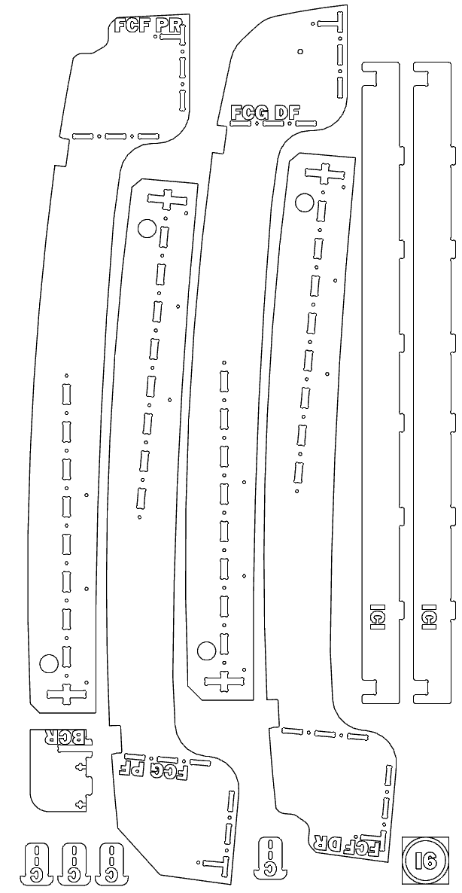

# Ram Promaster 159

The Ram Promaster 159" wheelbase offers the perfect balance between interior space and maneuverability, making it one of our most popular van options for van life conversions.

## 📐 Van Specifications

- **Wheelbase**: 159 inches
- **Roof Height**: High roof
- **Interior Length**: ~11.5 feet
- **Interior Width**: ~5.5 feet (widest in class)
- **Interior Height**: ~6.5 feet
- **Model Years**: 2014-Present (Vantopia kits for 2014+)

## 🎥 YouTube Tour

### Promaster 159 Dinette Tour
**[Watch Full Tour](https://youtu.be/QUEMvoSfhUU)**

This comprehensive tour showcases our popular dinette configuration in the Promaster 159, highlighting the perfect balance of space and functionality.

## 🖼️ 3D Renders

### Interactive 3D Models
Explore our configurations in full 3D:

- **[Promaster 159 Raised Bed](https://a360.co/4jF7Ifp)** - Interactive 3D render
- **[Promaster 159 Dinette Bed](https://a360.co/3E8WX5O)** - Interactive 3D render

## 🔧 Available Configurations

### Raised Bed Configuration
Maximize storage space with an elevated sleeping platform.

**Features:**
- Bed Platform: Elevated sleeping area with extensive storage underneath
- Overhead Cabinets: Full-length storage above bed
- Kitchen Island: Complete cooking station
- Full-Height Closet: Wardrobe and gear storage
- Accessory Bin: Additional storage solutions

### Dinette Configuration
Flexible dining and sleeping area for social van lifers.

**Features:**
- Convertible Dinette: Dining table that converts to bed
- Overhead Cabinets: Storage above dinette area
- Kitchen Island: Complete cooking station
- Full-Height Closet: Wardrobe and gear storage
- Accessory Bin: Additional storage solutions

---

## 📋 Complete Installation Guide

*Model: Ram Promaster 159 High Roof (Revised 11-11-2023)*

### Installation Time
- **Experienced DIYer**: 3-4 days
- **First-Time Builder**: 1-2 weeks
- **With Helper**: 2-3 days

---

## Step 1: Vent Installation

**[YouTube Video →](https://youtube.com)**  
**Personnel**: 2 person minimum  
**Time**: 2-4 hours

⚠️ **WARNING**: This step requires using a ladder and climbing onto the roof of a van. Having a second person to help stabilize a ladder and assist is strongly advised.

⚠️ **WARNING**: Safety glasses are critical for this step as chips of metal are produced. You do not want a chip of metal in your eye.

### Tools Required
- Hammer
- Drill
- Step bit up to 1"
- Center punch
- Measuring tape
- Saw for metal (jig saw or Sawzall)
- Metal cutting blade for saw
- Caulking gun (not shown in list but needed for Sikaflex)

### Hardware Required (Customer Supplied)
- Max Air vent or equivalent
- Butyl tape or equivalent
- Sikaflex or equivalent
- Rustoleum paint or equivalent

### Procedure

1. **Measure hole center point** using tape measure
   - Find centerline of vehicle by measuring between fixed points (find two screw holes that are symmetric across centerline of vehicle)
   - Place template and confirm no interference with van ribs or structural members
   - Once template is centered and parallel to van ribs, mark center hole with marker
   
2. **Drill hole** using step bit
   - Use center punch to mark center point of mark
   
3. **Align template** from top of vehicle
   - Once hole is drilled, move to top of vehicle and align template with newly created hole
   - Make sure template is parallel to known rib
   
4. **Mark corners** of vent template with marker

5. **Drill 4 corner points** with step bit
   - Make sure to place bit inside square, not on exact corner
   
6. **Cut lines** using jig saw to cut between 4 holes just drilled

7. **Test fit vent** in newly created square hole
   - Check for fit and any interference
   - If interference, use jig saw to cut away
   
8. **Build up bedding** using butyl tape
   - Bring up to height of ribs or any protruding elements
   
9. **Apply Sikaflex** or equivalent to bedding
   - Similar to putting icing on a cake
   - Use liberal amount of sealant (up to 1.5 tubes per vent is acceptable)
   
10. **Place vent** on bedding with sealant
    - Make sure vent is oriented properly (hinge on front side)
    - Ensure wires aren't trapped in sealant/bedding
    - Screw provided screws around perimeter using drill with Phillips bit
    - Screw until sealant appears to squeeze out from under rim
    
11. **Apply another layer** of sealant around perimeter

12. **Apply dabs of sealant** to each fastener
    - Add about as much volume as a Hershey Kiss chocolate per fastener (it may seem like a lot but it is common practice)

### Tips and Tricks
- Make sure to check orientation of vent before installing (vent hinge should be on front side)
- Make sure not to get wire pinched or caught in vent rim while installing

---

## Step 2: Insulation

**[YouTube Video →](https://youtube.com)**  
**Personnel**: 1 person minimum  
**Time**: 2-4 hours

⚠️ **WARNING**: Gloves, safety glasses, and N95 mask are recommended to reduce contact with spray adhesive.

### Tools Required
- Scissors (high quality)
- Safety glasses
- N95 mask
- Nitrile gloves (recommended)

### Hardware Required (Customer Supplied)
- Spray Adhesive
- 3M Thinsulate Insulation or equivalent
- Covering for seats

### Procedure

1. **Cover up front seats** with trash bags or purpose-made covers

2. **Cut pieces of insulation** to fit main exposed metal panels of van
   - Make sure not to place insulation on high points where rails and panels attach
   
3. **Spray adhesive on insulation** and then place in final location
   - Check to see that it's attached before releasing support
   
4. **Add chunks/scraps** of insulation to any cavity spaces that are accessible

### Tips and Tricks
- Use a piece of scrap cardboard to catch overspray

---

## Step 3: Sanding Kit Components

**[YouTube Video →](https://youtube.com)**  
**Personnel**: 1 person minimum, 2 recommended  
**Time**: 4-8 hours

⚠️ **WARNING**: N95 mask, safety glasses, and gloves are required.

### Tools Required
- Random Orbit sander (included with kit)
- Spindle sander (included with kit)
- Oscillating Tool (included with kit)

### Hardware Required
- Sanding pads (included with kit)
- Large cardboard pad or equivalent
- Sanding spindles for spindle sander (included with kit)

### Tips and Tricks
- Get a helper to assist moving frames to avoid cracking
- Save frames until completely finished with sanding/assembly
- Confirm you have all necessary parts

---

## Step 4: Flooring, Rail Mounts, and Wall Panels

**[YouTube Instructions →](https://youtube.com) | [Floor Trim Install →](https://youtube.com) | [Render Link →](https://youtube.com)**  
**Personnel**: 2 people recommended  
**Time**: 4-6 hours

⚠️ **WARNING**: Use Rivnut tool carefully and follow all safety precautions.

*Detailed installation procedures available in full installation manual.*

---

## Step 5: Kit Assembly

**[Main Assembly →](https://youtube.com)**  
**Personnel**: 1 person possible, 2 people recommended  
**Time**: 4-8 hours

**Note**: Video includes modules that are not included in every order.

### Configuration Options
- **[Adjustable Raised Bed Variant →](https://youtube.com)**
- **[Raised Bed Assembly →](https://youtube.com)**
- **[Dinette Bed Assembly →](https://youtube.com)**

### ⚠️ Special Note: Bed Upright Supports

**IMPORTANT**: Bed upright supports on the Promaster 159 have a **unique orientation** to account for the taper in the Promaster ceiling.

**Orientation Labels:**
- **PR**: Passenger Rear
- **DR**: Driver Rear
- **PF**: Passenger Front
- **DF**: Driver Front

Make sure to install each support in its designated position for proper fit!

### Tools Required
- Drill (optional)
- T30 Torx bit
- Needle nose pliers
- Phillips bits

### Hardware Required
- **Bag 1**: M6 by 45mm flat head screw ([McMaster 92125A250](https://www.mcmaster.com/92125A250/)) - Need 225
- **Bag 2**: M6 Rectangle screw (by Vantopia) - Need 225
- **Bag 3**: M8 by 90mm Button head screw ([McMaster 92095A336](https://www.mcmaster.com/92095A336/)) - Need 13
- **Bag 4**: Clevis pin 45mm with E clips - Need 6
- **Bag 5**: Washer .375" by 1.5" fender ([McMaster 90313A115](https://www.mcmaster.com/90313A115/)) - Need 35
- **Bag 6**: Washer .375" by 2" fender ([McMaster 90313A116](https://www.mcmaster.com/90313A116/)) - Need 2
- **Bag 7**: Nylon spacer .375 ID .75" OD by 1.25" long ([McMaster 94639A863](https://www.mcmaster.com/94639A863/)) - Need 6
- **Bag 8**: .375" by .875" washers ([McMaster 92141A031](https://www.mcmaster.com/92141A031/)) - Need 20
- **Bag 9**: M6 by 70mm flat head screws ([McMaster 92125A258](https://www.mcmaster.com/92125A258/)) - Need 8
- **Bag 10**: M6 by 30mm button head screws ([McMaster 92095A244](https://www.mcmaster.com/92095A244/)) - Need 28
- **Bag 11**: M6 washers ([McMaster 91116A150](https://www.mcmaster.com/91116A150/)) - Need 84
- **Bag 12**: Wooden dowels .5" by 1.5" ([McMaster 97195A116](https://www.mcmaster.com/97195A116/))
- **Bag 13**: Fixed casters ([McMaster 78155T17](https://www.mcmaster.com/78155T17/)) - Need 4
- **Bag 14**: Wood Screws
- **Bag 15**: T slot frame nut ([McMaster 5537T67](https://www.mcmaster.com/5537T67/)) - Need 28

---

## Step 6: Module Installation

**[YouTube Video →](https://youtube.com)**  
**Personnel**: 2 people recommended  
**Time**: 2-4 hours

Install optional modules like toilet closet, pantry combo unit, bathroom module, etc.

---

## Step 7: Finishing Details

**[YouTube Video →](https://youtube.com)**  
**Personnel**: 1-2 people  
**Time**: 4-6 hours

### Finishing Includes
- Bamboo faces
- Countertop installation
- Bamboo locks
- Drawer installation
- Tray tables

### Tools Required
- Drill
- Phillips bit
- Needle nose pliers
- Bamboo oil

### Hardware Required
- **Bag 25**: Drawer slides 20" ([McMaster 2712A6](https://www.mcmaster.com/2712A6/)) - Need 2 pair
- **Bag 12**: Wooden dowels .5" by 1.5" long ([McMaster 97195A116](https://www.mcmaster.com/97195A116/))
- **Bag 29**: Soft close hinges (by Vantopia) - Need 32
- **Bag 4**: 45mm Clevis pins with E clips - Need 27
- **Bag 8**: Washers .375 by .875" - Need 200
- **Bag 16**: M8 eye rings - Need 4

---

## 💡 Promaster 159 Specific Tips

### Advantages of the 159
- **Perfect Balance**: Great combination of space and drivability
- **Wide Interior**: Maximum width in its class for more usable space
- **Front-Wheel Drive**: Better handling and traction
- **Fuel Efficient**: Good MPG for its size
- **Comfortable Length**: Room for full-size amenities without being too long

### Configuration Recommendations

**For Couples:**
- **Dinette Configuration**: Provides dining and sleeping areas
- **Additional Storage**: Consider pantry combo unit
- **Comfort Features**: Room for larger appliances

**For Solo Travelers:**
- **Raised Bed Configuration**: Maximizes storage underneath
- **Compact Kitchen**: Efficient use of space
- **Workspace Options**: Room for laptop/work area

### Layout Considerations
- Take advantage of the wide body for side-to-side storage
- Utilize the front-wheel drive hump for creative storage solutions
- Consider the ceiling taper when planning overhead storage
- Plan for good cross-ventilation with multiple windows

---

## 📞 Support & Resources

Need help with your Promaster 159 build? We're here to assist:

- **Email**: Support@vantopiavans.com
- **Phone**: 949 755 0337
- **Build Consultations**: Free 30-minute sessions available

### Related Resources
- [Official Installation Instructions (Google Doc)](https://docs.google.com/document/d/1sx5bY_vYFkQk7yWYv62BEfPAcC28dH3aMqAXEXl_O28/edit?usp=sharing)
- [Electrical and Plumbing Parts List](../general-resources/electrical-and-plumbing-parts-list.md)
- [Main FAQ](../faq.md)
- [Promaster 136](promaster-136.md)
- [Mercedes Sprinter](mercedes-sprinter.md)
- [Ford Transit](ford-transit.md)

---

*Ready to start your Promaster 159 build? Contact us for current pricing and availability!*
